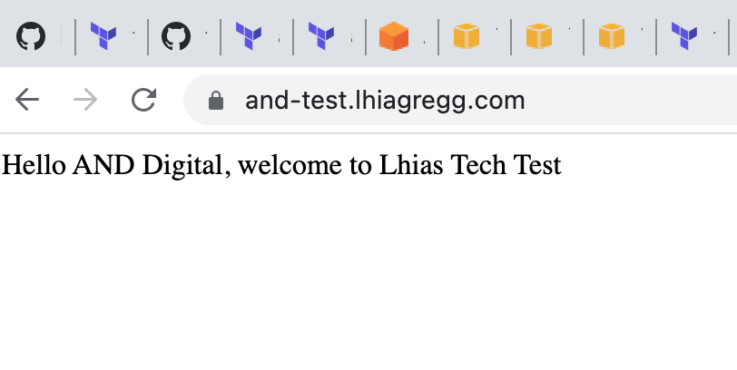

# terraform-tech-test

## The Brief
To create a load balanced front end in AWS that scales across multiple availability zones. There should be a minimum of 2 instances that run on Linux. The VPC should be split into appropriate subnets and the web page should be secure. Can use web server of choice.

## Solution

### Pre-requisites/Assumptions
- Must have an AWS account with appropriate access.
- This repo assumes AWS credentials are exported to the shell Terraform is ran from.
- I repurposed a hosted zone in Route 53 (lhiagregg.com) that was created outside of this project. Edit the `r53_hosted_zone` and `domain_name` variables with your own selected hosted zone/domain.

### Usage
Run `terraform init` at the root of the repo.
Run `terraform plan` to show the resources that will be created.
Run `terraform apply` to create the resources.

### Outcome
The result should be:
- A VPC with multiple public and private subnets, NAT gateways and an Internet gateway.
- An autoscaling group consisting of 2 Linux instances that are launched with Nginx installed (in private subnets).
- An application load balancer accessible in the public subnets, with the private ASG as the target group. 
- A configured SSL/TLS certificate so that HTTPS traffic is enabled. HTTP traffic will be redirected to HTTPS.
- Appropriately configured security groups (the ALB can receive traffic on ports 80 and 443 from anywhere, the servers can only receive traffic from the SG of the ALB on port 80). TLS is terminated at the load balancer.
- A domain name created in an existing hosted zone (this is just an alias record that points to the ALB).
- An example webpage should be displayed at the domain name - e.g. and-test.lhiagregg.com

## Next Steps

- At the moment, the tfstate file is only on my machine. Ideally this would live in S3, especially for working in remote teams.
- Terraform is ran manually off my local machine, ideally this would be ran from a CI/CD system.
- I have only created one environment. In the real world, I may need to create multiple configurations for multiple environments. To do this this I would make use of fvars files.

